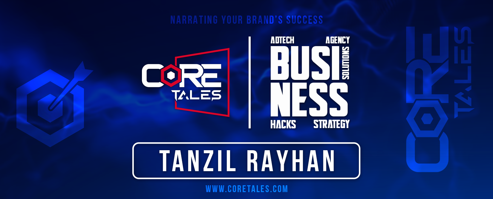

 

# 💫 Hello World !!!
## Tanzil here👋

I work at CoreTales as a web developer with experience in frontend and backend technologies. My diverse skill set allows me to create visually appealing and uniform web solutions. I'm excited to apply my abilities to innovative projects and to keep improving in this dynamic web development industry.
 

## 📊 GitHub Stats

 

 

## 🌐 Social Profiles

  

## 💻 Tech Stacks - Explored

### Languages 

### FrontEnd 

### BackEnd 

### Tools 

### Design 

